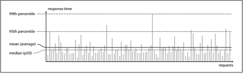
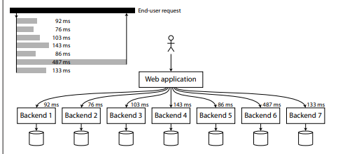

# Scalability

Scalability is a term that is used to describe a system's ability to cope with increasing load.

To make a system scalable we need to do the following :

## Describing Load

Load can be described with a few numbers which are called <strong>Load parameters</strong>. The best choice of parameters depends on our architecture. It can be :
- Request per second to a web server
- ratio of reads to write in a database
- the number of simultaneously active users in a chat room
- hit rate on a cache....etc

### The learning so far
- Describe the load with load parametes,which is the real bottleneck in your system
- Optimize for common operations 

## Describing performance

Once we have described the load on our system we can investigate what happens when we increase the load.
When judging the performance we can look at it in two ways: 
- When we increase the load parameters, and keep the system resources (CPU, memory, network bandwidth etc) unchanged. how the performance is affected at that time ?
- When we increase the load parameters, how much do you need to increase the resources if you want to keep the perforamnce unchanged ?

To measure the performance of a system  we need to have real numbers that describe it.

### Batch processing System vs Real time systems

- Batch processing system does not process the information immedietly instead it does it in batch after collecting all the information. For example <strong>Hadoop</strong> stores 1PB of company logs in a single day so instead of processing every log as soon as it comes hadoop will batch the logs for the day and process them at once at night or any scheduled time. Batch processing is useful when we do not need the result immedietly. For example
    -   Generate monthly invoices.
    -   Back up databases.
    -   Send millions of scheduled emails.
    -   Process applicatin logs.
    -   Process daily sales statistics.

- Real time processing systems are those who process the data as soon as it arrives and produce the result.Real time is important when the result needs to be available almost immedietly after an event happens.For example
    -   Payment Processing - User needs to know immedietly that payment succeeded or not
    -   Fraud detection - Suspicious transactions should be blocked immedietly.
    -   Uber location tracking - Driver and passenger needs current location.
    -   Chat Applications - Messages should appear immedietly.
    -   Notifications - User should receive an event immedietly.
    -   IOT monitoring - Temp and pressure should be detected immedietly.

### Desribing the performance of system 

In a Batch processing system we care about Throughput.Athough it not limited to batch processing only.

-   <strong>Throughput : </strong>The number of records we can process per second or total time it takes to run a job on a dataset of certain size.

In Online systems we talk more about response time.

-   <strong>Respose Time : </strong>The time between client sending a request and recieving a response. Response time also include the <strong>service time , network delays , queuing delays</strong>.

-   <strong>Service Time : </strong>The actual time the server spent processing our request. for example server takes 50ms.

-   <strong>Queuing Delay : </strong>The time for which our request was waiting to be processed. for example there are 100 more request already waiting then our request will also wait in queue, lets say its 100ms.

-   <strong>Network Delay : </strong>The time spent traveling between the computer and the server.lets say its 50ms

So total <strong>Response Time</strong> will be service time + queuing delay + network delay => 50ms+100ms+50ms = 200ms.

-   <strong>Latency : </strong>The time for which the request is being waiting to be handled, during which it is latent, awaiting service. we can call is queuing delay.

#### When measuring response time : median P50
 
To know our typical response time it is usually better to use percentile(%). If we take a list of response times and sort it from fastest to slowest, then the median is the half way point.
for example if our median = 200ms that means half of our requests return in less than 200ms and half of our request take longer than that.
so if we want to know how long our users have to wait to get the response we can use <strong>median</strong> as a metric.
so with median we can judge that half of our request are served before the median and half of them are after that.
The median is also called as <strong>P50 or 50th percentile.</strong>

#### When measuring response time : p95,p99,p999

Now there are outlier in our requests some requests take more time to process because they might be doing some extra work in backend. So to find the outliers we can use higher percentiles They are the response time threshold at which 95% , 99% or 99.9% of requests are faster than that particular threshold.

For example if 95th percentile response time is 1.5seconds that means 95 out of 100 requests take less than 1.5 seconds and 5 out of 100 request takes more than 1.5sec or more.

High percentile are important because they directly affects user's experience of the service.For example amazon describes response time requirement for internal services in terms of 99.9th percentile, even though it only affects 1 out 1000 request. This is because the  user with slowest requests are often those who have made many purchases.

Queuing delay plays a huge role in response time because a system has limitation of how many requests it can process in parallel(limited by cpu cores).For example if we have a slow request upfront which is taking time to process and subsequent requests are waiting on that blocking request than that would be a issue.it is called <strong>head of line. </strong>.

#### Percentile in practice
High percentiles become especially important in backend services that are called mul‐
tiple times as part of serving a single end-user request. Even if you make the calls in
parallel, the end-user request still needs to wait for the slowest of the parallel calls to
complete. It takes just one slow call to make the entire end-user request slow, as illus‐
trated in Figure 1-5. Even if only a small percentage of backend calls are slow, the
chance of getting a slow call increases if an end-user request requires multiple back‐
end calls, and so a higher proportion of end-user requests end up being slow [24].
If you want to add response time percentiles to the monitoring dashboards for your
services, you need to efficiently calculate them on an ongoing basis. For example, you
may want to keep a rolling window of response times of requests in the last ten
minutes. Every minute, you calculate the median and various percentiles over the val‐
ues in that window, and plot those metrics on a graph.
The naïve implementation is to keep a list of response times for all requests within the
time window, and to sort that list every minute. If that is too inefficient for you, there
are algorithms which can calculate a good approximation of percentiles at minimal
CPU and memory cost, such as forward decay [25], t-digest [26] or HdrHistogram
[27]. Beware that averaging percentiles, e.g. to reduce the time resolution or to com‐
bine data from several machines, is mathematically meaningless — the right way of
aggregating response time data is to add the histograms 

### Approaches for coping with load

When managing load we often talk about scaling up or scaling out.And the better approach can be the mixture of both.

- <strong>Scaling Up : </strong>Moving to a bigger and more powerful machine.
- <strong>Scaling out: </strong>Distributing the load across multiple smaller machines.

- <strong>Elastic systems : </strong>Systems that can automatically add more computing resources when they detect a load increase.An elastic system can be useful when the load is highly unpredictable.

- <strong>Manual systems : </strong>Where a human analyses the capacity and decides to add more machines to the system.

- <strong>Stateless service : </strong>A service that does not remember information about a client between requests.Each request is treated as a independent interaction.If a service needs information from a previous request, that information must be sent with the new request or retrived from a external system.

Distributing a stateless service across multiple machines is fairly simple but taking a stateful data system form a single node to a distributed setup can introduce a lot of additinal complexity.
Scaling application servers horizontally is relatively easy. Scaling databases(stateful machines) horizontally is much harder because the machines have to coordinate and maintain correct shared data. Therefore, traditionally, people preferred to keep databases on one powerful machine and only distribute them when they absolutely needed to—for cost, capacity, or high availability.

# Maintaniability 

When we desgin the systems we should keep in mind the three things that are:
- Operability
- Simplicity
- Evolvability

## Operability

The operation team are vital to keeping a softwere system running smoothly.A good operations teams typically does the following : 
-   monitoring the health of a system, quickly restoring service if it goes into a bad state.
-   tracking down the cause of a problem, such as system failures and degraded performance.
-   Keeping softwere and platforms up to date , including secruity patches.
-   keeping tabs on how different systems affects each other, so that a problematic change can be avoided before it causes damage.
-   Anticipating future problems and solving them before they occur, eg. capacity planning.
-   establishing good practics and tools for deployment, configuration management and more.
- preserving the organization's knowledege about the system even as individual people come and go.

## Simplicity

Making a system simpler does not neccessarily mean reducing its functionality; it can also mean removing accidental complexity. On of the best tools we have for removing accidental complxity is <strong>abstraction.</strong>

A good <strong>abstraction</strong> can hide a great deal of implementation detail behind a clean simple to understand facade.For example:
- High level programming languages are abstractions that hide machine code, CPU registers and syscalls. 
- SQL is an abstraction that hides complex on-disk and in memory data structres, concurrent requests from other clients.

Ofcourse when we are using high level programming language we are still using machine code , we are just not using it directly, because the programming language abstraction saves us form having to think about it.

## Evolvability:making change easy

It’s extremely unlikely that your system’s requirements will remain unchanged for‐
ever. Much more likely, it is in constant flux: you learn new facts, previously unanti‐
cipated use cases emerge, business priorities change, users request new features, new
platforms replace old platforms, legal or regulatory requirements change, growth of
the system forces architectural changes, etc.

In terms of organizational processes, agile working patterns provide a framework for
adapting to change. The agile community has also developed technical tools and pat‐
terns that are helpful when developing software in a frequently-changing environ‐
ment, such as test-driven development (TDD) and refactoring

